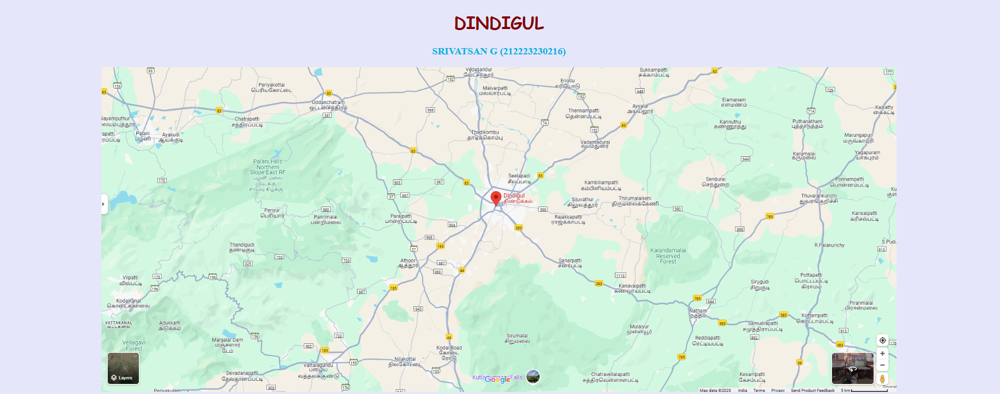
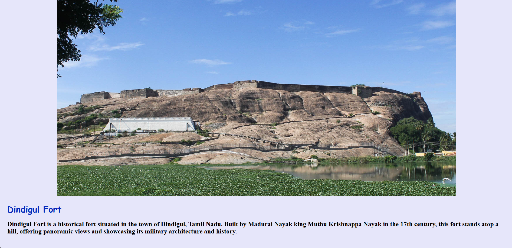
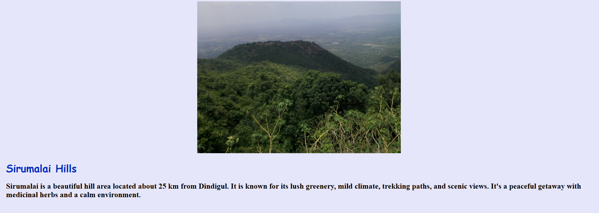
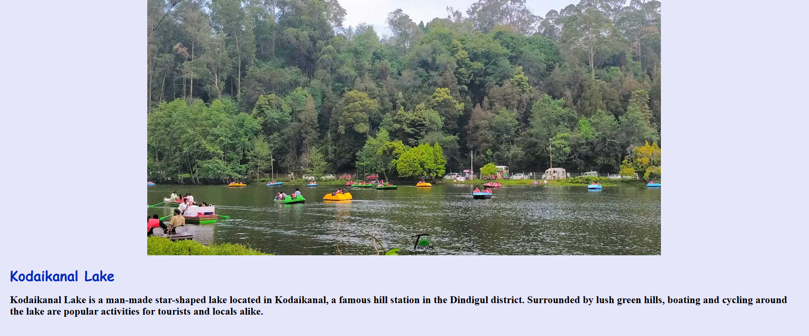
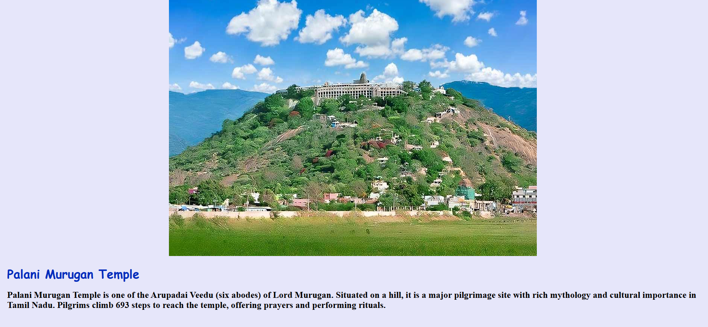

# Ex04 Places Around Me
# Date:28-04-2025
# AIM
To develop a website to display details about the places around my house.

# DESIGN STEPS
## STEP 1
Create a Django admin interface.

## STEP 2
Download your city map from Google.

## STEP 3
Using <map> tag name the map.

## STEP 4
Create clickable regions in the image using <area> tag.

## STEP 5
Write HTML programs for all the regions identified.

## STEP 6
Execute the programs and publish them.

# CODE
```
<!DOCTYPE html>
<html lang="en">
<head>
    <meta charset="UTF-8">
    <title>DINDIGUL TOURIST MAP</title>
    <style>
        body {
            background-color: lavender;
            font-family: serif;
        }
        .section {
  display: none;
  padding: 20px;
  opacity: 0;
  transition: opacity 0.5s ease;
}
.active {
  display: block;
  opacity: 1;
}
        h1 {
            color: rgb(3, 43, 189);
            font-family: cursive;
        }
        center img {
            max-width: 80%;
            height: auto;
        }
    </style>
    <script>
        function showSection(id) {
            const sections = document.querySelectorAll('.section');
            sections.forEach(sec => sec.classList.remove('active'));
            document.getElementById(id).classList.add('active');
        }
    </script>
</head>
<body>

    <h1 align="center"><font color="maroon"><b>DINDIGUL</b></font></h1>
    <h3 align="center"><font color="sky blue"><b>SRIVATSAN G (212223230216)</b></font></h3>
    
    <!-- Interactive Map -->
    <center>
        
        <map name="image-map">
            <area alt="Dindigul Fort" title="Dindigul Fort" onclick="showSection('Dindigul-Fort')" coords="700,250,850,300" shape="rect">
            <area alt="Sirumalai Hills" title="Sirumalai Hills" onclick="showSection('sirumalai')" coords="700,400,800,900" shape="rect">
            <area alt="Palani Murugan Temple" title="Palani Murugan Temple" onclick="showSection('palani-temple')" coords="40,100,100,200" shape="rect">
            <area alt="Kodaikanal Lake" title="Kodaikanal Lake" onclick="showSection('kodaikanal')" coords="40,50,100,700" shape="rect">
        </map>
    </center>
    
    <!-- Dindigul Fort Section -->
    <div id="Dindigul-Fort" class="section">
        <center></center>
        <h1>Dindigul Fort</h1>
        <h2>Dindigul Fort is a historical fort situated in the town of Dindigul, Tamil Nadu. 
            Built by Madurai Nayak king Muthu Krishnappa Nayak in the 17th century, this fort stands atop a hill, offering panoramic views 
            and showcasing its military architecture and history.</h2>
    </div>
    
    <!-- Sirumalai Hills Section -->
    <div id="sirumalai" class="section">
        <center></center>
        <h1>Sirumalai Hills</h1>
        <h2>Sirumalai is a beautiful hill area located about 25 km from Dindigul. 
            It is known for its lush greenery, mild climate, trekking paths, and scenic views. It's a peaceful getaway 
            with medicinal herbs and a calm environment.</h2>
    </div>
    
    <!-- Palani Murugan Temple Section -->
    <div id="palani-temple" class="section">
        <center></center>
        <h1>Palani Murugan Temple</h1>
        <h2>Palani Murugan Temple is one of the Arupadai Veedu (six abodes) of Lord Murugan. 
            Situated on a hill, it is a major pilgrimage site with rich mythology and cultural importance in Tamil Nadu. 
            Pilgrims climb 693 steps to reach the temple, offering prayers and performing rituals.</h2>
    </div>
    
    <!-- Kodaikanal Lake Section -->
    <div id="kodaikanal" class="section">
        <center></center>
        <h1>Kodaikanal Lake</h1>
        <h2>Kodaikanal Lake is a man-made star-shaped lake located in Kodaikanal, 
            a famous hill station in the Dindigul district. Surrounded by lush green hills, boating and cycling around the lake 
            are popular activities for tourists and locals alike.</h2>
    </div>
    
</body>
</html>


```
# OUTPUT






# RESULT
The program for implementing image maps using HTML is executed successfully.
